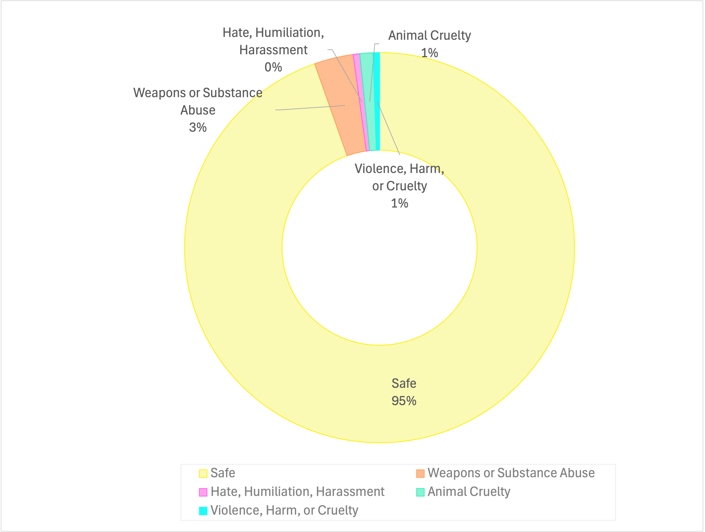

<div align="center" style="margin-top:50px;"> 
   
   &nbsp;
<div style="margin-top: 20px;">
   <h1>AIN: The Arabic INclusive Multimodal Model</h1> 

  [](https://arxiv.org/abs/2410.18976)
  [](https://example.com)
  [](https://github.com/mbzuai-oryx/Camel-Bench/issues)
  [](https://github.com/mbzuai-oryx/AIN/stargazers)
  [](https://github.com/mbzuai-oryx/Camel-Bench/blob/main/LICENSE)
<br>
<br>
<br>

---
  <h2>⭐ ⭐ ⭐ ⭐ ⭐ ⭐ ⭐ ⭐ ⭐ ⭐ Try Our AIN Model ⭐ ⭐ ⭐ ⭐ ⭐ ⭐ ⭐ ⭐ ⭐ ⭐ </h2>
   &emsp; &emsp;  &emsp;
  
  &emsp; <a href="https://huggingface.co/spaces/ahmedheakl/AIN-Arabic-VLM" target="_blank">AIN Demo Chatbot</a>
   &emsp; &emsp;
  
  &emsp; <a href="https://t.me/arabicvlm_bot" target="_blank">AIN Telegram</a>
 &emsp; &emsp;
  
  &emsp; <a href="https://wa.me/46738645096" target="_blank">AIN WhatsApp</a> 
    <h2>⭐ ⭐ ⭐ ⭐ ⭐ ⭐ ⭐ ⭐ ⭐ ⭐  ⭐ ⭐ ⭐ ⭐  ⭐ ⭐ ⭐ ⭐ ⭐ ⭐ ⭐ ⭐ ⭐ ⭐ ⭐ ⭐ ⭐ ⭐ </h2>
</div>
</div>

---
<br>
<br>

## 📢 Latest Updates
 🔥 **Jan 2025** AIN-7B model the first Arabic Inclusive LMM is released 🤗.
 🚀 Model weights will be released soon. 
<br>
<br>


## 📖 Overview
<p style="text-align: justify">
AIN, the <b>Arabic Inclusive Multimodal Model</b>, bridges the gap in generative AI for Arabic by leveraging Modern Standard Arabic (MSA) data to achieve state-of-the-art performance across diverse tasks and specialized domains. AIN is a <b>bilingual model</b> (MSA and English) with broad applications from <b>medical</b> to <b>agricultural</b> domains, excelling in <b>OCR and Document Understanding</b>, and <b>Remote Sensing Imaging</b>. Trained on <b>3.6M </b>samples, where <b>35%</b> of its Arabic data comes from authentic sources. Built on Qwen-2-VL, AIN empowers Arabic speakers with advanced, inclusive AI capabilities, outperforming leading models in key benchmarks. </p>
<br>
<p align="center" >
   
 <h6>
       <em>  <b>Figure 1.</b> showcases a comprehensive performance analysis of AIN-7B across CAMEL-Bench domains, comparing it with prominent closed-source models as well as open-source counterparts. <strong>OCR:</strong> "OCR & Document Understanding",  <strong>Video:</strong> "General Video & Multi-Image Understanding",  <strong>RS:</strong> "Remote Sensing Understanding", <strong>CDT:</strong> "Chart, Diagram & Table Understanding",  <strong>Agro.:</strong> "Agricultural Image Understanding", <strong>Cultural:</strong> "Cultural-Specific Understanding", <strong>Medical:</strong> "Medical Image Understanding".
       </em> 
 </h6>
<br>
<br>
</p> 

AIN is a versatile LMM excelling in visual and contextual understanding across diverse domains, including VQA on complex topics, OCR for various fonts and handwriting, cultural insights (traditions, food, places), agricultural tasks (crop identification, fruit classification, disease detection), remote sensing (multi-scale objects), medical imaging (various modalities), and video analysis (animation, human activities).
<br>
<br>
  
 ## 🌟 Key Features
 - The **first Arabic-centric inclusive Large Multimodal Model (LMM)** trained on **3.6M samples**.
 - Includes **35% authentic Arabic data** within its Arabic data subset.
 - Achieves **superior performance compared to open- and closed-source models** (e.g., GPT-4o) and open-source models (e.g., Qwen2-VL-7B) across tasks such as OCR and specialized domains.
 - Demonstrates **robust bilingual capabilities** (Arabic/English), **validated** through **comprehensive testing** and **human evaluation** across 17 Arab countries.
 - Exhibits **advanced cultural understanding** and domain expertise in fields such as **medical imaging**, **agriculture**, and **scientific visualization**.

<p align="center">
   
   <h6>
       <em>  <b>Figure 2.</b> Comparative performance of AIN-7B against other models across key domains, including OCR & Document Understanding, Remote Sensing, Agricultural Understanding, and overall performance across all domains. </em>
   </h6>
</p> 
<br>

---
## ⚖️ Quantitative Evaluation and Results
AIN demonstrates state-of-the-art performance across diverse domains, surpassing both open- and closed-source models. Notably, it achieves an aggregate performance score of 63.77%, with significant gains in OCR, remote sensing, and agricultural image understanding.

<p align="center">
<table>
    <caption>
        <h6>
        <strong>Table 1. Performance comparison of AIN and different closed- and open-source LMMs across CAMEL-Bench domains.</strong> 
        <br> <em>Best performance is marked with 🥇; second-best is 🥈.</em>
            <strong>OCR</strong>: "OCR & Document Understanding", 
            <strong>Video</strong>: "General Video & Multi-Image Understanding", 
            <strong>RS</strong>: "Remote Sensing Understanding", 
            <strong>CDT</strong>: "Chart, Diagram & Table Understanding", 
            <strong>Agro.</strong>: "Agricultural Image Understanding", 
            <strong>Cult.</strong>: "Cultural-Specific Understanding",  
            <strong>Med.</strong>: "Medical Image Understanding".
        </h6>
    </caption>
    <thead>
        <tr style="background-color: #e0e0e0;">
            <th>Models</th>
            <th>VQA</th>
            <th>OCR</th>
            <th>Video</th>
            <th>RS</th>
            <th>CDT</th>
            <th>Agro.</th>
            <th>Cult.</th>
            <th>Med.</th>
            <th style="background-color: #d0d0d0;">Total</th>
        </tr>
    </thead>
    <tbody>
        <tr>
            <td><h5>GPT-4o</h5></td>
            <td><h5>🥇57.91</h5></td>
            <td><h5>🥈54.68</h5></td>
            <td><h5>🥇74.28</h5></td>
            <td><h5>🥈22.85</h5></td>
            <td><h5>62.12</h5></td>
            <td><h5>🥈81.79</h5></td>
            <td><h5>🥇79.92</h5></td>
            <td><h5>🥇49.26</h5></td>
            <td><h5>🥈60.35</h5></td>
        </tr>
        <tr>
            <td><h5>GPT-4o-mini</h5></td>
            <td><h5>48.83</h5></td>
            <td><h5>39.38</h5></td>
           <td><h5>🥈68.12</h5></td>
            <td><h5>16.93</h5></td>
            <td><h5>🥇70.16</h5></td>
            <td><h5>79.58</h5></td>
            <td><h5>65.92</h5></td>
           <td><h5>🥈47.37</h5></td>
            <td style="background-color: #d0d0d0;"><h5>54.54</h5></td>
        </tr>
        <tr>
            <td><h5>Gemini-1.5-Pro</h5></td>
            <td><h5>46.68</h5></td>
            <td><h5>28.68</h5></td>
            <td><h5>42.95</h5></td>
            <td><h5>17.07</h5></td>
            <td><h5>47.06</h5></td>
            <td><h5>72.14</h5></td>
            <td><h5>56.24</h5></td>
            <td><h5>33.78</h5></td>
            <td style="background-color: #d0d0d0;"><h5>52.38</h5></td>
        </tr>
        <tr>
            <td><h5>Gemini-1.5-flash</h5></td>
            <td><h5>45.59</h5></td>
            <td><h5>27.58</h5></td>
            <td><h5>53.31</h5></td>
            <td><h5>14.95</h5></td>
            <td><h5>48.26</h5></td>
            <td><h5>76.07</h5></td>
            <td><h5>46.54</h5></td>
            <td><h5>42.87</h5></td>
            <td style="background-color: #d0d0d0;"><h5>44.40</h5></td>
        </tr>
        <tr>
            <td><h5>InternVL-8B</h5> </td>
            <td><h5>30.41</h5> </td>
            <td><h5>15.91</h5> </td>
            <td><h5>51.42</h5> </td>
            <td><h5>5.36</h5> </td>
            <td><h5>30.27</h5> </td>
            <td><h5>44.47</h5> </td>
            <td><h5>20.88</h5> </td>
            <td><h5>29.48</h5> </td>
            <td style="background-color: #d0d0d0;"><h5>28.52</h5> </td>
        </tr>
        <tr>
            <td><h5>InternVL2.5-1B</h5> </td>
            <td><h5>27.22</h5> </td>
            <td><h5>19.45</h5> </td>
            <td><h5>38.20</h5> </td>
            <td><h5>3.39</h5> </td>
            <td><h5>30.75</h5> </td>
            <td><h5>39.53</h5> </td>
            <td><h5>35.68</h5> </td>
            <td><h5>21.27</h5> </td>
            <td style="background-color: #d0d0d0;"><h5>26.94</h5> </td>
        </tr>
        <tr>
            <td><h5>Qwen-VL-2B</h5> </td>
            <td><h5>41.02</h5> </td>
            <td><h5>22.93</h5> </td>
            <td><h5>38.90</h5> </td>
            <td><h5>12.56</h5> </td>
            <td><h5>27.83</h5> </td>
            <td><h5>52.02</h5> </td>
            <td><h5>34.28</h5> </td>
            <td><h5>29.12</h5> </td>
            <td style="background-color: #d0d0d0;"><h5>32.33</h5> </td>
        </tr>
        <tr>
            <td><h5>AIN-7B <em>(ours)</em></h5> </td>
           <td><h5>🥈56.78</h5> </td>
            <td><h5>🥇72.35</h5> </td>
            <td><h5>64.09</h5> </td>
            <td><h5>🥇45.92</h5> </td>
           <td><h5>🥈64.10</h5> </td>
            <td><h5>🥇85.05</h5> </td>
           <td><h5>🥈78.09</h5> </td>
            <td><h5>43.77</h5> </td>
            <td style="background-color: #d0d0d0;"><h5>🏆63.77</h5> </td>
        </tr>
    </tbody>
</table>
    </p>           
<br>


## 🎯 Qualitative Evaluation
The qualitative evaluation showcases AIN's advanced capabilities in handling diverse, complex tasks, including OCR, medical imaging, remote sensing, and cultural-specific understanding, with remarkable precision and contextual relevance. Unlike GPT-4o and LLaVA, AIN demonstrates superior performance in identifying intricate details and maintaining accuracy across varied query formats and multi-domain challenges.

<div style="display: flex; justify-content: center; align-items: center; gap: 10px; margin-top: 20px;">
  <p align="center" >
  
  
     <h6>
       <em>  <b>Figure 3.</b> Left: Comparison of AIN-7B’s qualitative performance against other models across multiple domains. Right: Qualitative examples showcasing AIN-7B’s capabilities across various domains, including general VQA, OCR & Document Understanding, Remote Sensing, Medical Imaging, Agricultural Understanding, and Cultural-Specific tasks. </em>
    </h6>
  </p> 
</div>
<br>

---
## 🧐 Data Verification and Toxicity Filtering
A multi-step verification pipeline was implemented to ensure high-quality translations and safe visual data. Translation accuracy was assessed through human evaluation, where native Arabic speakers rated outputs against reference translations, and semantic similarity checks were conducted using **LaBSE**. Additionally, translated samples were reverse-translated and validated using **BLEU, METEOR, and ROUGE scores** to measure correctness, correlation, and overlap. For visual data, toxicity filtering was applied using **LLavaGuard’s safety policies and GPT-4o**, identifying and removing unsafe content related to violence, substance abuse, and harmful imagery, ensuring compliance with ethical AI standards.

<p align="center">
   
    <h6>
       <em>  <b>Figure 4.</b> Data verification and filtering pipeline for textual and visual data, ensuring high-quality training data through semantic similarity checks, translation quality evaluations, and toxicity screening for safety compliance. </em>
    </h6>
</p> 
<br>
<br>
<p align="center">
   
    <h6>
       <em>  <b>Figure 5.</b> Distribution of visual data toxicity filtering results, showing that 95% of the data is classified as safe, while 5% is identified as unsafe due to categories like weapons or substance abuse, violence, and animal cruelty. </em>
   </h6>
</p> 
<br>
<br>

---
##  License
This project is licensed under the MIT License - see the [LICENSE](LICENSE) file for details.
<br>
<br>

## 💬 Contact us
For questions or suggestions, feel free to reach out to us on [GitHub Discussions](https://github.com/mbzuai-oryx/AIN/discussions).

---

## 📚 Citation

If you use AIN LMM in your research, please consider citing:

```bibtex

```
<br>

---
<p align="center">
   
   
   
</p>
