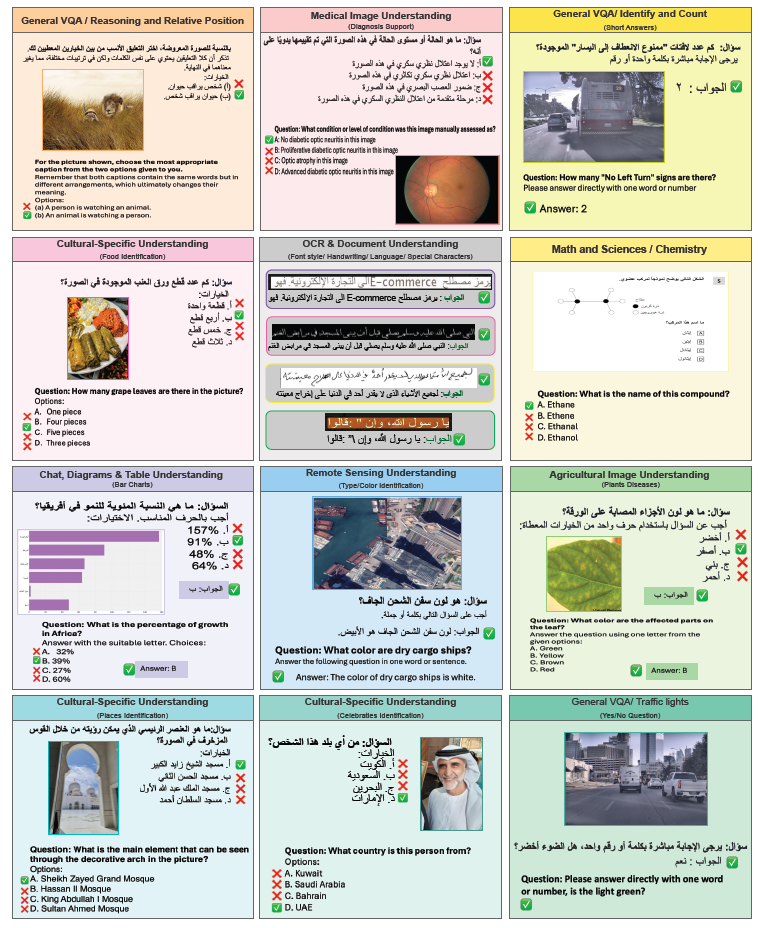

 
   
 <h1> AIN: The Arabic INclusive Multimodal Model</h1>

<!-- 00FAFA -->

  [](https://arxiv.org/abs/2410.18976)
  [](https://example.com)
  [](https://huggingface.co/spaces/ahmedheakl/AIN-Arabic-VLM)
  [](https://t.me/arabicvlm_bot)
  [](https://github.com/mbzuai-oryx/Camel-Bench/issues)
  [](https://github.com/mbzuai-oryx/Camel-Bench/stargazers)
  [](https://github.com/mbzuai-oryx/Camel-Bench/blob/main/LICENSE)
<br> 
<br>

## 📖 Overview
<p style="text-align: justify">
AIN, the <b>Arabic Inclusive Multimodal Model</b>, bridges the gap in generative AI for Arabic by leveraging Modern Standard Arabic (MSA) data to achieve state-of-the-art performance across diverse tasks and specialized domains. AIN is a <b>bilingual model</b> (MSA and English) with broad applications from <b>medical</b> to <b>agricultural</b> domains, excelling in <b>OCR and Document Understanding</b>, and <b>Remote Sensing Imaging</b>. Trained on <b>3.6M </b>samples, where <b>35%</b> of its Arabic data comes from authentic sources. Built on Qwen-2-VL, AIN empowers Arabic speakers with advanced, inclusive AI capabilities, outperforming leading models in key benchmarks. </p>
<br>
<p align="center">
   
<br>
<br>
</p> 

AIN is a versatile LMM excelling in visual and contextual understanding across diverse domains, including VQA on complex topics, OCR for various fonts and handwriting, cultural insights (traditions, food, places), agricultural tasks (crop identification, fruit classification, disease detection), remote sensing (multi-scale objects), medical imaging (various modalities), and video analysis (animation, human activities).
<br>
<br>
  
 ## 🌟 Key Features
 - The **first Arabic-centric inclusive Large Multimodal Model (LMM)** trained on **3.6M samples**.
 - Includes **35% authentic Arabic data** within its Arabic data subset.
 - Achieves **superior performance compared to open- and closed-source models** (e.g., GPT-4o) and open-source models (e.g., Qwen2-VL-7B) across tasks such as OCR and specialized domains.
 - Demonstrates **robust bilingual capabilities** (Arabic/English), **validated** through **comprehensive testing** and **human evaluation** across 17 Arab countries.
 - Exhibits **advanced cultural understanding** and domain expertise in fields such as **medical imaging**, **agriculture**, and **scientific visualization**.

<p align="center">
   
</p> 
<br>
<br>

## 📢 Latest Updates
- **Jan 2025** 🔥  [ 🤗]

<br>
<br>

## ⚖️ Quantitative Evaluation and Results
AIN demonstrates state-of-the-art performance across diverse domains, surpassing both open- and closed-source models. Notably, it achieves an aggregate performance score of 63.77%, with significant gains in OCR, remote sensing, and agricultural image understanding.

<p align="center">
   
</p> 
<br>
<br>

## 🎯 Qualitative Evaluation
The qualitative evaluation showcases AIN's advanced capabilities in handling diverse, complex tasks, including OCR, medical imaging, remote sensing, and cultural-specific understanding, with remarkable precision and contextual relevance. Unlike GPT-4o and LLaVA, AIN demonstrates superior performance in identifying intricate details and maintaining accuracy across varied query formats and multi-domain challenges.

<div style="display: flex; justify-content: center; align-items: center; gap: 10px; margin-top: 20px;">
  <p align="center" >
  
  
  </p> 
</div>
<br>
<br>

## 🧐 Data Verification and Toxicity Filtering

<p align="center">
   
</p> 
<br>
<br>

## Getting Started

The benchmark can be easily executed using the provided scripts:

```sh
$ python scripts/eval_qwen.py
```

To evaluate your model, just modify the `generate_qwen` function in `scripts/eval_qwen.py`. 

## Dataset

Our dataset is hosted on HuggingFace, and can be accessed here: [CAMEL-Bench Dataset 🤗](https://huggingface.co/collections/ahmedheakl/camel-bench-670750f3998395452cd3b7b1).

## Citation

If you use CAMEL-Bench in your research, please consider citing:

```bibtex

```

## 🛡️ License

This project is licensed under the MIT License - see the [LICENSE](LICENSE) file for details.

##  🔗 Join Us!
🤖


[](https://github.com/mbzuai-oryx/Camel-Bench/network/members)
[](https://github.com/mbzuai-oryx/Camel-Bench/stargazers)

## 💬 Contact us

For questions or suggestions, feel free to reach out to us on [GitHub Discussions](https://github.com/mbzuai-oryx/AIN/discussions).

